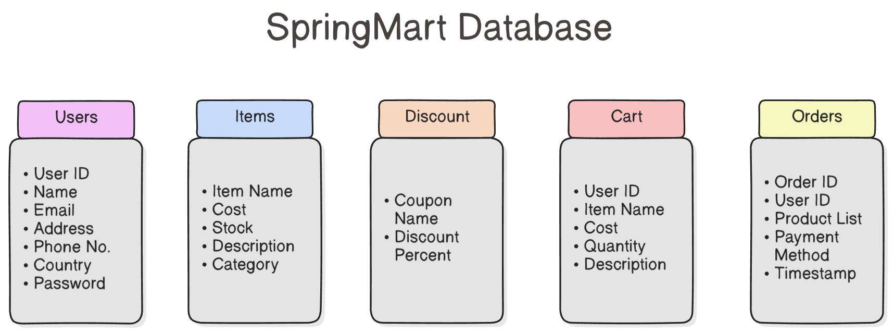
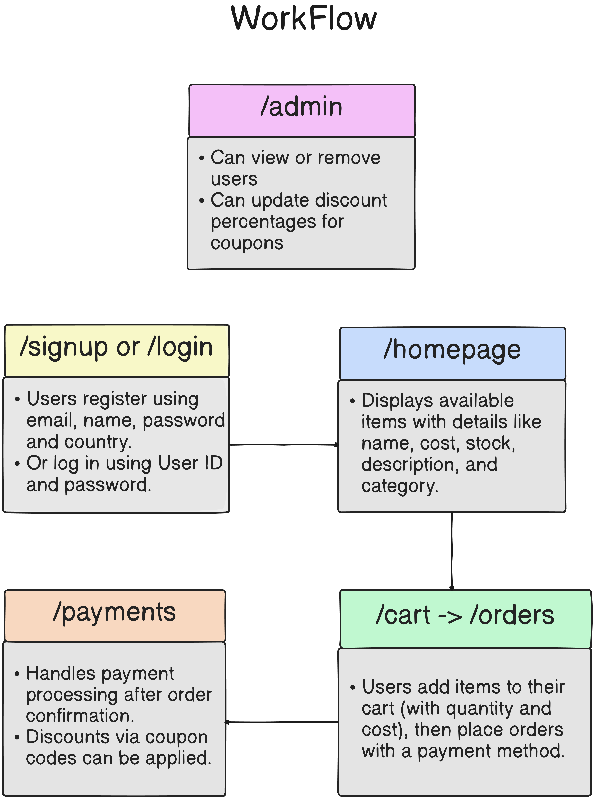

# SpringMart 

SpringMart is a basic Spring Boot application designed to simulate an e-commerce management system. 
This project is built using `Java`, `Spring Boot`, and `Maven`, and follows a `MVC` architecture with clear separation of concerns (Controller, Service, Repository layers).

# Usage 
```bash 
git clone git@github.com:Git-Cat-21/SpringMart.git
cd SpringMart
```
### Build and run with Maven
```bash
./mvnw clean install 
./mvnw spring-boot:run
```

## Build and run with Docker image
```bash
docker build . -t springmart 
docker run -it --rm -p 8080:8080 springmart
```

## Database Structure



## Workflow Structure


